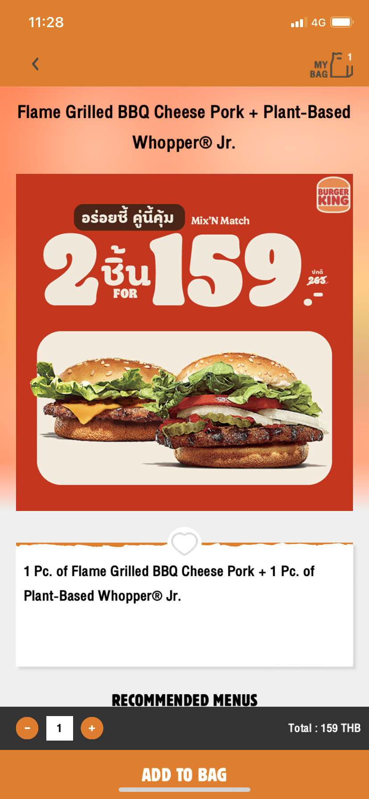

## MBK PLUS
**Platform:** iOS\
**Architectural Pattern:** MVC\
**Language:** Swift\
**Technologies:** Push Notifications, Facebook SDK, Line SDK, Firebase Analytics, Matomo Analytics

  
  
  
  
  

## Megabangna
**Platform:** iOS\
**Architectural Pattern:** MVC\
**Language:** Swift\
**Technologies:** Push Notifications, Facebook SDK, Line SDK, Firebase Analytics, Matomo Analytics

  
  
  
  
  
  

## A+ Genius Baby
**Platform:** iOS\
**Architectural Pattern:** MVC\
**Language:** Swift\
**Technologies:** Push Notifications, Core Graphics, Firebase Analytics

  
  
  
  
  

## Burger King Thailand
**Platform:** iOS\
**Architectural Pattern:** MVC\
**Language:** Swift\
**Technologies:** Push Notifications, Core Location, Facebook SDK, Firebase Analytics, Google Analytics, Matomo Analytics

  
  
  
  
  

## BHPetrol X-Fleet
**Platform:** iOS\
**Architectural Pattern:** MVC\
**Language:** Swift\
**Technologies:** Push Notifications, Firebase Analytics, Matomo Analytics

  
  
  
  
  

___

See more my custom ui components with Swift in [here](https://github.com/napaphatvir/customView)
